# UC02 Prior Authorization Dataset Schema Documentation

This document describes the actual dataset discovered and profiled from `backend/data/synthea/`. 

## Data Relationship Graph
The dataset is patient-centric. Clinical files reference patients by their patient IDs:

```mermaid
erDiagram
    Patient ||--o{ Condition : has
    Patient ||--o{ Medication : takes
    Patient ||--o{ Procedure : undergoes
    Patient ||--o{ DiagnosticResult : receives
    Patient ||--o{ VitalSign : records
    Patient ||--o{ Encounter : visits
    Patient ||--o{ CarePlan : follows
    Patient ||--o{ ClinicalAssessment : completes
    Patient ||--o{ Allergy : has
    Patient ||--o{ Surgery : undergoes
    Patient ||--o{ FunctionalStatus : assesses
    Patient ||--o{ Referral : references
    Patient ||--o{ MedicalEquipment : uses
    Patient ||--o{ Claim : bills
    Patient ||--o{ Coverage : covers
    Patient ||--o{ AuthorizationRequest : requests
    
    Provider ||--o{ Encounter : performs
    Provider ||--o{ Procedure : performs
    Provider ||--o{ Surgery : performs
    Provider ||--o{ Referral : refers
```



---

## File Classifications
Each CSV has been classified into its corresponding clinical pipeline category:

| Category | Files |
| --- | --- |
| **A. Patient identity / demographics** | `patients.csv` |
| **B. Clinical conditions** | `conditions.csv` |
| **C. Treatment history** | `medications.csv`, `procedures.csv`, `surgeries.csv` |
| **D. Diagnostic evidence** | `diagnostic_results.csv`, `vital_signs.csv` |
| **E. Encounters** | `encounters.csv` |
| **F. Functional / clinical assessments** | `functional_status.csv`, `clinical_assessments.csv` |
| **G. Prior Authorization requests** | `authorization_requests.csv` |
| **H. Provider information** | `providers.csv` |
| **I. Claims / insurance coverage** | `claims.csv`, `coverage.csv` |
| **J. Other supporting evidence** | `allergies.csv`, `care_plans.csv`, `family_history.csv`, `immunizations.csv`, `medical_equipment.csv`, `referrals.csv`, `social_history.csv` |

---

## Detailed Schema Profiling

### `allergies.csv`
* **Category**: J. Other supporting evidence
* **Row Count**: 40
* **Primary Key Candidate**: `allergy_id` (Duplicates: No (All values unique))
* **Patient Identifier**: `patient_id`
* **Encounter Identifier**: `None`
* **Provider Identifier**: `None`
* **Authorization Identifier**: `None`
* **Relevance to UC02**: Supporting: Documented drug or environmental allergies.

#### Columns & Null Values Check:
| Column Name | Null/Missing Count | Percent Missing |
| --- | --- | --- |
| `allergy_id` | 0 | 0.0% |
| `patient_id` | 0 | 0.0% |
| `allergen_type` | 0 | 0.0% |
| `allergen_name` | 0 | 0.0% |
| `reaction_severity` | 0 | 0.0% |
| `onset_date` | 0 | 0.0% |
| `active_status` | 0 | 0.0% |
| `conflict_alert_flag` | 0 | 0.0% |

#### Date/Time Columns Detected:
- `onset_date`

#### Sample Rows:
```json
{'allergy_id': 'ALG0001', 'patient_id': 'PAT001', 'allergen_type': 'Medication', 'allergen_name': 'Ibuprofen', 'reaction_severity': 'Moderate', 'onset_date': '2024-01-19', 'active_status': 'Inactive', 'conflict_alert_flag': 'FALSE'}
{'allergy_id': 'ALG0002', 'patient_id': 'PAT008', 'allergen_type': 'Medication', 'allergen_name': 'Sulfa Drugs', 'reaction_severity': 'Moderate', 'onset_date': '2014-04-23', 'active_status': 'Inactive', 'conflict_alert_flag': 'FALSE'}
```

---

### `authorization_requests.csv`
* **Category**: G. Prior Authorization requests
* **Row Count**: 50
* **Primary Key Candidate**: `request_id` (Duplicates: No (All values unique))
* **Patient Identifier**: `patient_id`
* **Encounter Identifier**: `None`
* **Provider Identifier**: `provider_id`
* **Authorization Identifier**: `None`
* **Relevance to UC02**: Essential: The core prior authorization requests containing CPT codes, diagnoses, requested procedures, and clinical notes to be triaged.

#### Columns & Null Values Check:
| Column Name | Null/Missing Count | Percent Missing |
| --- | --- | --- |
| `request_id` | 0 | 0.0% |
| `patient_id` | 0 | 0.0% |
| `provider_id` | 0 | 0.0% |
| `requested_procedure_code` | 0 | 0.0% |
| `diagnosis_code` | 0 | 0.0% |
| `clinical_indication` | 0 | 0.0% |
| `medical_necessity` | 0 | 0.0% |
| `provider_justification` | 0 | 0.0% |
| `urgency` | 0 | 0.0% |
| `requested_quantity` | 0 | 0.0% |
| `requested_duration_days` | 0 | 0.0% |
| `request_date` | 0 | 0.0% |
| `status` | 0 | 0.0% |
| `previous_treatment_info` | 0 | 0.0% |
| `supporting_evidence_url` | 0 | 0.0% |
| `ai_reasoning` | 12 | 24.0% |

#### Date/Time Columns Detected:
- `request_date`

#### Sample Rows:
```json
{'request_id': 'AUTH00001', 'patient_id': 'PAT014', 'provider_id': 'PRV012', 'requested_procedure_code': 'PROC6042', 'diagnosis_code': 'DIAG50', 'clinical_indication': 'Limited mobility', 'medical_necessity': 'Patient requires procedure due to persistent symptoms affecting daily life', 'provider_justification': 'Conservative treatments failed, escalating care required.', 'urgency': 'Urgent', 'requested_quantity': '8', 'requested_duration_days': '60', 'request_date': '2026-07-11', 'status': 'PENDING', 'previous_treatment_info': 'Treatment B received for 1 months', 'supporting_evidence_url': 'https://evidence-store.com/doc_1.pdf', 'ai_reasoning': 'N/A'}
{'request_id': 'AUTH00002', 'patient_id': 'PAT008', 'provider_id': 'PRV015', 'requested_procedure_code': 'PROC8917', 'diagnosis_code': 'DIAG18', 'clinical_indication': 'Inflammation', 'medical_necessity': 'Patient requires procedure due to persistent symptoms affecting daily life', 'provider_justification': 'Conservative treatments failed, escalating care required.', 'urgency': 'Routine', 'requested_quantity': '7', 'requested_duration_days': '90', 'request_date': '2026-07-06', 'status': 'PENDING', 'previous_treatment_info': 'Treatment A received for 2 months', 'supporting_evidence_url': 'https://evidence-store.com/doc_2.pdf', 'ai_reasoning': 'N/A'}
```

---

### `care_plans.csv`
* **Category**: J. Other supporting evidence
* **Row Count**: 40
* **Primary Key Candidate**: `plan_id` (Duplicates: No (All values unique))
* **Patient Identifier**: `patient_id`
* **Encounter Identifier**: `None`
* **Provider Identifier**: `provider_id`
* **Authorization Identifier**: `None`
* **Relevance to UC02**: Supporting: Care plans and goals. Low direct relevance to PA.

#### Columns & Null Values Check:
| Column Name | Null/Missing Count | Percent Missing |
| --- | --- | --- |
| `plan_id` | 0 | 0.0% |
| `patient_id` | 0 | 0.0% |
| `provider_id` | 0 | 0.0% |
| `current_treatment_plan` | 0 | 0.0% |
| `planned_procedures` | 0 | 0.0% |
| `treatment_goals` | 0 | 0.0% |
| `start_date` | 0 | 0.0% |
| `end_date` | 0 | 0.0% |
| `treatments_attempted` | 13 | 32.5% |
| `status` | 0 | 0.0% |

#### Date/Time Columns Detected:
- `start_date`
- `end_date`

#### Sample Rows:
```json
{'plan_id': 'CP0001', 'patient_id': 'PAT026', 'provider_id': 'PRV001', 'current_treatment_plan': 'Post-operative Recovery', 'planned_procedures': 'Wound care, Mobilization', 'treatment_goals': 'Full range of motion, No infection', 'start_date': '2026-04-10', 'end_date': '2026-08-14', 'treatments_attempted': 'None', 'status': 'Active'}
{'plan_id': 'CP0002', 'patient_id': 'PAT023', 'provider_id': 'PRV004', 'current_treatment_plan': 'Conservative Pain Management', 'planned_procedures': 'Physical Therapy', 'treatment_goals': 'Reduce pain by 50%', 'start_date': '2026-04-06', 'end_date': '2026-09-23', 'treatments_attempted': 'Physical Therapy', 'status': 'Active'}
```

---

### `claims.csv`
* **Category**: I. Claims / insurance coverage
* **Row Count**: 100
* **Primary Key Candidate**: `claim_id` (Duplicates: No (All values unique))
* **Patient Identifier**: `patient_id`
* **Encounter Identifier**: `None`
* **Provider Identifier**: `provider_id`
* **Authorization Identifier**: `None`
* **Relevance to UC02**: Supporting: Insurer billing and claim history. Low clinical relevance.

#### Columns & Null Values Check:
| Column Name | Null/Missing Count | Percent Missing |
| --- | --- | --- |
| `claim_id` | 0 | 0.0% |
| `patient_id` | 0 | 0.0% |
| `provider_id` | 0 | 0.0% |
| `procedure_code` | 0 | 0.0% |
| `diagnosis_code` | 0 | 0.0% |
| `claim_status` | 0 | 0.0% |
| `treatment_date` | 0 | 0.0% |
| `service_type` | 0 | 0.0% |
| `treatment_name` | 0 | 0.0% |
| `amount_billed` | 0 | 0.0% |
| `amount_paid` | 0 | 0.0% |
| `treatment_frequency` | 0 | 0.0% |
| `step_therapy_verified` | 31 | 31.0% |
| `previous_auth_history` | 32 | 32.0% |
| `duplicate_service_flag` | 0 | 0.0% |

#### Date/Time Columns Detected:
- `treatment_date`

#### Sample Rows:
```json
{'claim_id': 'CLM00001', 'patient_id': 'PAT030', 'provider_id': 'PRV006', 'procedure_code': 'PROC5535', 'diagnosis_code': 'DIAG27', 'claim_status': 'REJECTED', 'treatment_date': '2026-01-09', 'service_type': 'Therapy', 'treatment_name': 'Treatment D', 'amount_billed': '2296.71', 'amount_paid': '735.24', 'treatment_frequency': '12', 'step_therapy_verified': 'N/A', 'previous_auth_history': 'Approved previously', 'duplicate_service_flag': 'FALSE'}
{'claim_id': 'CLM00002', 'patient_id': 'PAT013', 'provider_id': 'PRV005', 'procedure_code': 'PROC6997', 'diagnosis_code': 'DIAG47', 'claim_status': 'PENDING', 'treatment_date': '2025-09-22', 'service_type': 'Surgery', 'treatment_name': 'Treatment A', 'amount_billed': '4326.4', 'amount_paid': '1038.88', 'treatment_frequency': '11', 'step_therapy_verified': 'NO', 'previous_auth_history': 'Approved previously', 'duplicate_service_flag': 'FALSE'}
```

---

### `clinical_assessments.csv`
* **Category**: F. Functional / clinical assessments
* **Row Count**: 60
* **Primary Key Candidate**: `assessment_id` (Duplicates: No (All values unique))
* **Patient Identifier**: `patient_id`
* **Encounter Identifier**: `None`
* **Provider Identifier**: `None`
* **Authorization Identifier**: `None`
* **Relevance to UC02**: Supporting: Clinical assessment summaries and results.

#### Columns & Null Values Check:
| Column Name | Null/Missing Count | Percent Missing |
| --- | --- | --- |
| `assessment_id` | 0 | 0.0% |
| `patient_id` | 0 | 0.0% |
| `assessment_date` | 0 | 0.0% |
| `assessment_type` | 0 | 0.0% |
| `score` | 0 | 0.0% |
| `severity_level` | 4 | 6.7% |
| `threshold_met` | 0 | 0.0% |
| `progression_trend` | 12 | 20.0% |

#### Date/Time Columns Detected:
- `assessment_date`

#### Sample Rows:
```json
{'assessment_id': 'ASM00001', 'patient_id': 'PAT029', 'assessment_date': '2026-06-24', 'assessment_type': 'GAD-7 (Anxiety)', 'score': '16', 'severity_level': 'Severe', 'threshold_met': 'YES', 'progression_trend': 'Improving'}
{'assessment_id': 'ASM00002', 'patient_id': 'PAT027', 'assessment_date': '2026-03-22', 'assessment_type': 'Pain Scale', 'score': '0', 'severity_level': 'None', 'threshold_met': 'NO', 'progression_trend': 'N/A'}
```

---

### `conditions.csv`
* **Category**: B. Clinical conditions
* **Row Count**: 80
* **Primary Key Candidate**: `condition_id` (Duplicates: No (All values unique))
* **Patient Identifier**: `patient_id`
* **Encounter Identifier**: `None`
* **Provider Identifier**: `None`
* **Authorization Identifier**: `None`
* **Relevance to UC02**: Essential: Used to query historical and active conditions/diagnoses of a patient for prior authorization clinical matching.

#### Columns & Null Values Check:
| Column Name | Null/Missing Count | Percent Missing |
| --- | --- | --- |
| `condition_id` | 0 | 0.0% |
| `patient_id` | 0 | 0.0% |
| `diagnosis_code` | 0 | 0.0% |
| `diagnosis_name` | 0 | 0.0% |
| `onset_date` | 0 | 0.0% |
| `resolution_date` | 45 | 56.2% |
| `condition_type` | 0 | 0.0% |
| `relevant_to_procedure_flag` | 0 | 0.0% |

#### Date/Time Columns Detected:
- `onset_date`
- `resolution_date`

#### Sample Rows:
```json
{'condition_id': 'COND0001', 'patient_id': 'PAT025', 'diagnosis_code': 'S82.009A', 'diagnosis_name': 'Fracture of patella', 'onset_date': '2023-04-23', 'resolution_date': '2023-05-09', 'condition_type': 'Acute', 'relevant_to_procedure_flag': 'TRUE'}
{'condition_id': 'COND0002', 'patient_id': 'PAT013', 'diagnosis_code': 'I10', 'diagnosis_name': 'Hypertension', 'onset_date': '2022-03-25', 'resolution_date': 'N/A', 'condition_type': 'Chronic', 'relevant_to_procedure_flag': 'FALSE'}
```

---

### `coverage.csv`
* **Category**: I. Claims / insurance coverage
* **Row Count**: 30
* **Primary Key Candidate**: `patient_id` (Duplicates: No (All values unique))
* **Patient Identifier**: `patient_id`
* **Encounter Identifier**: `None`
* **Provider Identifier**: `None`
* **Authorization Identifier**: `None`
* **Relevance to UC02**: Supporting: Insurance coverage policies and status details.

#### Columns & Null Values Check:
| Column Name | Null/Missing Count | Percent Missing |
| --- | --- | --- |
| `patient_id` | 0 | 0.0% |
| `plan_id` | 0 | 0.0% |
| `insurance_company` | 0 | 0.0% |
| `plan_type` | 0 | 0.0% |
| `effective_date` | 0 | 0.0% |
| `expiry_date` | 0 | 0.0% |
| `is_active` | 0 | 0.0% |
| `requires_prior_auth` | 0 | 0.0% |
| `benefits_summary` | 0 | 0.0% |
| `covered_services` | 0 | 0.0% |
| `copay_amount` | 0 | 0.0% |
| `deductible` | 0 | 0.0% |

#### Date/Time Columns Detected:
- `effective_date`
- `expiry_date`

#### Sample Rows:
```json
{'patient_id': 'PAT001', 'plan_id': 'PLAN1206', 'insurance_company': 'Aetna', 'plan_type': 'HMO', 'effective_date': '2023-02-27', 'expiry_date': '2024-02-27', 'is_active': 'YES', 'requires_prior_auth': 'YES', 'benefits_summary': 'Standard medical, vision, dental', 'covered_services': 'Consultation, Surgery, Therapy', 'copay_amount': '10', 'deductible': '500'}
{'patient_id': 'PAT002', 'plan_id': 'PLAN1315', 'insurance_company': 'UnitedHealth', 'plan_type': 'PPO', 'effective_date': '2023-05-09', 'expiry_date': '2024-05-08', 'is_active': 'NO', 'requires_prior_auth': 'YES', 'benefits_summary': 'Standard medical, vision, dental', 'covered_services': 'Consultation, Surgery, Therapy', 'copay_amount': '20', 'deductible': '1000'}
```

---

### `diagnostic_results.csv`
* **Category**: D. Diagnostic evidence
* **Row Count**: 80
* **Primary Key Candidate**: `result_id` (Duplicates: No (All values unique))
* **Patient Identifier**: `patient_id`
* **Encounter Identifier**: `None`
* **Provider Identifier**: `None`
* **Authorization Identifier**: `None`
* **Relevance to UC02**: Essential: Diagnostic tests (e.g. HbA1c, Knee X-ray, Lumbar Spine MRI) and their clinical results/findings.

#### Columns & Null Values Check:
| Column Name | Null/Missing Count | Percent Missing |
| --- | --- | --- |
| `result_id` | 0 | 0.0% |
| `patient_id` | 0 | 0.0% |
| `test_name` | 0 | 0.0% |
| `test_date` | 0 | 0.0% |
| `result_value` | 0 | 0.0% |
| `reference_range` | 0 | 0.0% |
| `abnormal_flag` | 0 | 0.0% |
| `evidence_for_medical_necessity` | 0 | 0.0% |

#### Date/Time Columns Detected:
- `test_date`

#### Sample Rows:
```json
{'result_id': 'DIAG0001', 'patient_id': 'PAT017', 'test_name': 'HbA1c', 'test_date': '2026-07-09', 'result_value': '8.0%', 'reference_range': '< 5.7%', 'abnormal_flag': 'TRUE', 'evidence_for_medical_necessity': 'TRUE'}
{'result_id': 'DIAG0002', 'patient_id': 'PAT023', 'test_name': 'X-Ray Knee', 'test_date': '2026-03-07', 'result_value': 'Severe Osteoarthritis', 'reference_range': 'Normal', 'abnormal_flag': 'TRUE', 'evidence_for_medical_necessity': 'TRUE'}
```

---

### `encounters.csv`
* **Category**: E. Encounters
* **Row Count**: 80
* **Primary Key Candidate**: `encounter_id` (Duplicates: No (All values unique))
* **Patient Identifier**: `patient_id`
* **Encounter Identifier**: `encounter_id`
* **Provider Identifier**: `provider_id`
* **Authorization Identifier**: `None`
* **Relevance to UC02**: Supporting: Outlines historical clinical encounters (visits). Provides context for patient provider visits.

#### Columns & Null Values Check:
| Column Name | Null/Missing Count | Percent Missing |
| --- | --- | --- |
| `encounter_id` | 0 | 0.0% |
| `patient_id` | 0 | 0.0% |
| `provider_id` | 0 | 0.0% |
| `encounter_date` | 0 | 0.0% |
| `encounter_type` | 0 | 0.0% |
| `primary_diagnosis_code` | 0 | 0.0% |
| `discharge_status` | 0 | 0.0% |
| `follow_up_required` | 0 | 0.0% |
| `recent_hospitalization_flag` | 0 | 0.0% |

#### Date/Time Columns Detected:
- `encounter_date`

#### Sample Rows:
```json
{'encounter_id': 'ENC00001', 'patient_id': 'PAT015', 'provider_id': 'PRV001', 'encounter_date': '2025-09-17', 'encounter_type': 'Inpatient', 'primary_diagnosis_code': 'DIAG74', 'discharge_status': 'Routine Discharge', 'follow_up_required': 'NO', 'recent_hospitalization_flag': 'TRUE'}
{'encounter_id': 'ENC00002', 'patient_id': 'PAT002', 'provider_id': 'PRV003', 'encounter_date': '2026-06-17', 'encounter_type': 'Urgent Care', 'primary_diagnosis_code': 'DIAG76', 'discharge_status': 'Routine Discharge', 'follow_up_required': 'NO', 'recent_hospitalization_flag': 'FALSE'}
```

---

### `family_history.csv`
* **Category**: J. Other supporting evidence
* **Row Count**: 40
* **Primary Key Candidate**: `history_id` (Duplicates: No (All values unique))
* **Patient Identifier**: `patient_id`
* **Encounter Identifier**: `None`
* **Provider Identifier**: `None`
* **Authorization Identifier**: `None`
* **Relevance to UC02**: Supporting: Family member conditions. Low direct relevance.

#### Columns & Null Values Check:
| Column Name | Null/Missing Count | Percent Missing |
| --- | --- | --- |
| `history_id` | 0 | 0.0% |
| `patient_id` | 0 | 0.0% |
| `family_member_relation` | 0 | 0.0% |
| `condition` | 0 | 0.0% |
| `age_of_onset` | 0 | 0.0% |
| `genetic_risk_indicator` | 0 | 0.0% |

#### Date/Time Columns Detected:
- None

#### Sample Rows:
```json
{'history_id': 'FH0001', 'patient_id': 'PAT001', 'family_member_relation': 'Father', 'condition': 'Hypertension', 'age_of_onset': '68', 'genetic_risk_indicator': 'Medium'}
{'history_id': 'FH0002', 'patient_id': 'PAT028', 'family_member_relation': 'Father', 'condition': 'Breast Cancer', 'age_of_onset': '39', 'genetic_risk_indicator': 'High'}
```

---

### `functional_status.csv`
* **Category**: F. Functional / clinical assessments
* **Row Count**: 60
* **Primary Key Candidate**: `status_id` (Duplicates: No (All values unique))
* **Patient Identifier**: `patient_id`
* **Encounter Identifier**: `None`
* **Provider Identifier**: `None`
* **Authorization Identifier**: `None`
* **Relevance to UC02**: Supporting: Functional and mental assessments. Helpful to verify functional limitations for mobility-related procedures.

#### Columns & Null Values Check:
| Column Name | Null/Missing Count | Percent Missing |
| --- | --- | --- |
| `status_id` | 0 | 0.0% |
| `patient_id` | 0 | 0.0% |
| `assessment_date` | 0 | 0.0% |
| `physical_functional_status` | 0 | 0.0% |
| `mental_functional_status` | 0 | 0.0% |
| `quality_of_life_score` | 0 | 0.0% |
| `deterioration_detected` | 0 | 0.0% |
| `pre_post_treatment_flag` | 0 | 0.0% |
| `rehab_support_needed` | 0 | 0.0% |

#### Date/Time Columns Detected:
- `assessment_date`

#### Sample Rows:
```json
{'status_id': 'FS0001', 'patient_id': 'PAT022', 'assessment_date': '2025-09-29', 'physical_functional_status': 'Dependent', 'mental_functional_status': 'Severe Impairment', 'quality_of_life_score': '9', 'deterioration_detected': 'FALSE', 'pre_post_treatment_flag': 'Post-treatment', 'rehab_support_needed': 'TRUE'}
{'status_id': 'FS0002', 'patient_id': 'PAT010', 'assessment_date': '2026-05-26', 'physical_functional_status': 'Dependent', 'mental_functional_status': 'Intact', 'quality_of_life_score': '2', 'deterioration_detected': 'TRUE', 'pre_post_treatment_flag': 'Post-treatment', 'rehab_support_needed': 'TRUE'}
```

---

### `immunizations.csv`
* **Category**: J. Other supporting evidence
* **Row Count**: 60
* **Primary Key Candidate**: `immunization_id` (Duplicates: No (All values unique))
* **Patient Identifier**: `patient_id`
* **Encounter Identifier**: `None`
* **Provider Identifier**: `None`
* **Authorization Identifier**: `None`
* **Relevance to UC02**: Supporting: Lists vaccine records. Low direct relevance to prior authorization triage for surgeries/RAG.

#### Columns & Null Values Check:
| Column Name | Null/Missing Count | Percent Missing |
| --- | --- | --- |
| `immunization_id` | 0 | 0.0% |
| `patient_id` | 0 | 0.0% |
| `vaccine_name` | 0 | 0.0% |
| `dose_number` | 0 | 0.0% |
| `date_administered` | 0 | 0.0% |
| `next_due_date` | 10 | 16.7% |
| `status` | 0 | 0.0% |

#### Date/Time Columns Detected:
- `date_administered`
- `next_due_date`

#### Sample Rows:
```json
{'immunization_id': 'IMM0001', 'patient_id': 'PAT026', 'vaccine_name': 'Pneumococcal', 'dose_number': '1', 'date_administered': '2026-01-19', 'next_due_date': '2036-01-17', 'status': 'Completed'}
{'immunization_id': 'IMM0002', 'patient_id': 'PAT006', 'vaccine_name': 'Tdap', 'dose_number': '3', 'date_administered': '2024-10-27', 'next_due_date': '2034-10-25', 'status': 'Completed'}
```

---

### `medical_equipment.csv`
* **Category**: J. Other supporting evidence
* **Row Count**: 40
* **Primary Key Candidate**: `equipment_id` (Duplicates: No (All values unique))
* **Patient Identifier**: `patient_id`
* **Encounter Identifier**: `None`
* **Provider Identifier**: `None`
* **Authorization Identifier**: `None`
* **Relevance to UC02**: Supporting: Issued durable medical equipment. Helpful for checking physical therapy or support aids history.

#### Columns & Null Values Check:
| Column Name | Null/Missing Count | Percent Missing |
| --- | --- | --- |
| `equipment_id` | 0 | 0.0% |
| `patient_id` | 0 | 0.0% |
| `equipment_type` | 0 | 0.0% |
| `date_issued` | 0 | 0.0% |
| `expected_replacement_date` | 0 | 0.0% |
| `current_status` | 0 | 0.0% |
| `usage_frequency` | 0 | 0.0% |
| `duplicate_request_flag` | 0 | 0.0% |

#### Date/Time Columns Detected:
- `date_issued`
- `expected_replacement_date`

#### Sample Rows:
```json
{'equipment_id': 'EQ0001', 'patient_id': 'PAT012', 'equipment_type': 'Blood Glucose Monitor', 'date_issued': '2025-03-01', 'expected_replacement_date': '2026-03-01', 'current_status': 'Active (Overdue)', 'usage_frequency': 'As needed', 'duplicate_request_flag': 'FALSE'}
{'equipment_id': 'EQ0002', 'patient_id': 'PAT009', 'equipment_type': 'Wheelchair', 'date_issued': '2021-11-06', 'expected_replacement_date': '2026-11-05', 'current_status': 'Active', 'usage_frequency': 'As needed', 'duplicate_request_flag': 'FALSE'}
```

---

### `medications.csv`
* **Category**: C. Treatment history
* **Row Count**: 100
* **Primary Key Candidate**: `medication_id` (Duplicates: No (All values unique))
* **Patient Identifier**: `patient_id`
* **Encounter Identifier**: `None`
* **Provider Identifier**: `None`
* **Authorization Identifier**: `None`
* **Relevance to UC02**: Essential: Contains medication history. Important for verifying conservative treatment history and step therapy compliance.

#### Columns & Null Values Check:
| Column Name | Null/Missing Count | Percent Missing |
| --- | --- | --- |
| `medication_id` | 0 | 0.0% |
| `patient_id` | 0 | 0.0% |
| `medication_name` | 0 | 0.0% |
| `dosage` | 0 | 0.0% |
| `start_date` | 0 | 0.0% |
| `end_date` | 48 | 48.0% |
| `status` | 0 | 0.0% |
| `step_therapy_requirement_met` | 0 | 0.0% |

#### Date/Time Columns Detected:
- `start_date`
- `end_date`

#### Sample Rows:
```json
{'medication_id': 'MED0001', 'patient_id': 'PAT028', 'medication_name': 'Metformin', 'dosage': '500mg twice daily', 'start_date': '2023-02-17', 'end_date': '2023-11-17', 'status': 'Discontinued', 'step_therapy_requirement_met': 'FALSE'}
{'medication_id': 'MED0002', 'patient_id': 'PAT016', 'medication_name': 'Lisinopril', 'dosage': '10mg daily', 'start_date': '2025-06-06', 'end_date': 'N/A', 'status': 'Active', 'step_therapy_requirement_met': 'FALSE'}
```

---

### `patients.csv`
* **Category**: A. Patient identity / demographics
* **Row Count**: 40
* **Primary Key Candidate**: `patient_id` (Duplicates: No (All values unique))
* **Patient Identifier**: `patient_id`
* **Encounter Identifier**: `None`
* **Provider Identifier**: `None`
* **Authorization Identifier**: `None`
* **Relevance to UC02**: Essential: Contains demographic details of patients used for identification, age calculation, and profile mapping.

#### Columns & Null Values Check:
| Column Name | Null/Missing Count | Percent Missing |
| --- | --- | --- |
| `patient_id` | 0 | 0.0% |
| `first_name` | 0 | 0.0% |
| `last_name` | 0 | 0.0% |
| `dob` | 0 | 0.0% |
| `age` | 0 | 0.0% |
| `gender` | 0 | 0.0% |
| `insurance_plan` | 0 | 0.0% |
| `member_id` | 0 | 0.0% |
| `summary_card_text` | 0 | 0.0% |

#### Date/Time Columns Detected:
- None

#### Sample Rows:
```json
{'patient_id': 'PAT001', 'first_name': 'FirstName1', 'last_name': 'LastName1', 'dob': '1955-07-06', 'age': '71', 'gender': 'M', 'insurance_plan': 'Aetna HMO', 'member_id': 'MEM997044', 'summary_card_text': 'Patient: PAT001 | Age: 71 | Coverage: Aetna HMO'}
{'patient_id': 'PAT002', 'first_name': 'FirstName2', 'last_name': 'LastName2', 'dob': '1961-10-26', 'age': '64', 'gender': 'F', 'insurance_plan': 'Cigna', 'member_id': 'MEM436157', 'summary_card_text': 'Patient: PAT002 | Age: 64 | Coverage: Cigna'}
```

---

### `procedures.csv`
* **Category**: C. Treatment history
* **Row Count**: 60
* **Primary Key Candidate**: `procedure_record_id` (Duplicates: No (All values unique))
* **Patient Identifier**: `patient_id`
* **Encounter Identifier**: `None`
* **Provider Identifier**: `provider_id`
* **Authorization Identifier**: `None`
* **Relevance to UC02**: Essential: Lists historical procedures received by patients. Helps check if conservative or required initial procedures were completed.

#### Columns & Null Values Check:
| Column Name | Null/Missing Count | Percent Missing |
| --- | --- | --- |
| `procedure_record_id` | 0 | 0.0% |
| `patient_id` | 0 | 0.0% |
| `provider_id` | 0 | 0.0% |
| `procedure_code` | 0 | 0.0% |
| `procedure_name` | 0 | 0.0% |
| `procedure_date` | 0 | 0.0% |
| `outcome` | 0 | 0.0% |
| `related_to_current_request` | 0 | 0.0% |

#### Date/Time Columns Detected:
- `procedure_date`

#### Sample Rows:
```json
{'procedure_record_id': 'PRC0001', 'patient_id': 'PAT020', 'provider_id': 'PRV010', 'procedure_code': 'CPT27447', 'procedure_name': 'Total Knee Arthroplasty', 'procedure_date': '2024-06-22', 'outcome': 'Successful', 'related_to_current_request': 'FALSE'}
{'procedure_record_id': 'PRC0002', 'patient_id': 'PAT016', 'provider_id': 'PRV015', 'procedure_code': 'CPT97110', 'procedure_name': 'Therapeutic Exercise', 'procedure_date': '2024-03-09', 'outcome': 'Failed', 'related_to_current_request': 'TRUE'}
```

---

### `providers.csv`
* **Category**: H. Provider information
* **Row Count**: 15
* **Primary Key Candidate**: `provider_id` (Duplicates: No (All values unique))
* **Patient Identifier**: `None`
* **Encounter Identifier**: `None`
* **Provider Identifier**: `provider_id`
* **Authorization Identifier**: `None`
* **Relevance to UC02**: Supporting: Medical provider details (specialty, facility, network status, NPI).

#### Columns & Null Values Check:
| Column Name | Null/Missing Count | Percent Missing |
| --- | --- | --- |
| `provider_id` | 0 | 0.0% |
| `first_name` | 0 | 0.0% |
| `last_name` | 0 | 0.0% |
| `specialty` | 0 | 0.0% |
| `facility_name` | 0 | 0.0% |
| `network_status` | 0 | 0.0% |
| `npi` | 0 | 0.0% |
| `contact_number` | 0 | 0.0% |
| `referral_required` | 0 | 0.0% |

#### Date/Time Columns Detected:
- None

#### Sample Rows:
```json
{'provider_id': 'PRV001', 'first_name': 'First1', 'last_name': 'Last1', 'specialty': 'Oncology', 'facility_name': 'Medical Center Gamma', 'network_status': 'Out-of-Network', 'npi': '1928374601', 'contact_number': '555-0101', 'referral_required': 'YES'}
{'provider_id': 'PRV002', 'first_name': 'First2', 'last_name': 'Last2', 'specialty': 'Oncology', 'facility_name': 'Medical Center Beta', 'network_status': 'Out-of-Network', 'npi': '1928374602', 'contact_number': '555-0102', 'referral_required': 'YES'}
```

---

### `referrals.csv`
* **Category**: J. Other supporting evidence
* **Row Count**: 50
* **Primary Key Candidate**: `referral_id` (Duplicates: No (All values unique))
* **Patient Identifier**: `patient_id`
* **Encounter Identifier**: `None`
* **Provider Identifier**: `referring_provider_id`
* **Authorization Identifier**: `None`
* **Relevance to UC02**: Supporting: Referrals from primary care to specialists.

#### Columns & Null Values Check:
| Column Name | Null/Missing Count | Percent Missing |
| --- | --- | --- |
| `referral_id` | 0 | 0.0% |
| `patient_id` | 0 | 0.0% |
| `referring_provider_id` | 0 | 0.0% |
| `specialist_provider_id` | 0 | 0.0% |
| `specialty_required` | 0 | 0.0% |
| `referral_date` | 0 | 0.0% |
| `expiration_date` | 0 | 0.0% |
| `referral_status` | 0 | 0.0% |
| `authorization_status` | 0 | 0.0% |

#### Date/Time Columns Detected:
- `referral_date`
- `expiration_date`

#### Sample Rows:
```json
{'referral_id': 'REF0001', 'patient_id': 'PAT017', 'referring_provider_id': 'PRV001', 'specialist_provider_id': 'PRV006', 'specialty_required': 'Physical Therapy', 'referral_date': '2026-06-17', 'expiration_date': '2026-09-15', 'referral_status': 'Fulfilled', 'authorization_status': 'Not Required'}
{'referral_id': 'REF0002', 'patient_id': 'PAT018', 'referring_provider_id': 'PRV003', 'specialist_provider_id': 'PRV010', 'specialty_required': 'Physical Therapy', 'referral_date': '2026-04-12', 'expiration_date': '2026-07-11', 'referral_status': 'Expired', 'authorization_status': 'Required'}
```

---

### `social_history.csv`
* **Category**: J. Other supporting evidence
* **Row Count**: 30
* **Primary Key Candidate**: `social_history_id` (Duplicates: No (All values unique))
* **Patient Identifier**: `patient_id`
* **Encounter Identifier**: `None`
* **Provider Identifier**: `None`
* **Authorization Identifier**: `None`
* **Relevance to UC02**: Supporting: Lifestyle risk factors (e.g. smoking, alcohol). Low direct relevance.

#### Columns & Null Values Check:
| Column Name | Null/Missing Count | Percent Missing |
| --- | --- | --- |
| `social_history_id` | 0 | 0.0% |
| `patient_id` | 0 | 0.0% |
| `smoking_status` | 0 | 0.0% |
| `alcohol_history` | 10 | 33.3% |
| `substance_history` | 26 | 86.7% |
| `lifestyle_factors` | 0 | 0.0% |
| `social_risk_factors` | 9 | 30.0% |
| `clinical_assessment_context` | 0 | 0.0% |

#### Date/Time Columns Detected:
- None

#### Sample Rows:
```json
{'social_history_id': 'SH0001', 'patient_id': 'PAT001', 'smoking_status': 'Never', 'alcohol_history': 'Occasional', 'substance_history': 'None', 'lifestyle_factors': 'Sedentary', 'social_risk_factors': 'Lack of Transportation', 'clinical_assessment_context': 'Risk-factor identified'}
{'social_history_id': 'SH0002', 'patient_id': 'PAT002', 'smoking_status': 'Never', 'alcohol_history': 'Occasional', 'substance_history': 'None', 'lifestyle_factors': 'Moderately Active', 'social_risk_factors': 'Food Insecurity', 'clinical_assessment_context': 'Risk-factor identified'}
```

---

### `surgeries.csv`
* **Category**: C. Treatment history
* **Row Count**: 50
* **Primary Key Candidate**: `surgery_id` (Duplicates: No (All values unique))
* **Patient Identifier**: `patient_id`
* **Encounter Identifier**: `None`
* **Provider Identifier**: `provider_id`
* **Authorization Identifier**: `None`
* **Relevance to UC02**: Essential: Historical surgical interventions. Helps match past treatment history.

#### Columns & Null Values Check:
| Column Name | Null/Missing Count | Percent Missing |
| --- | --- | --- |
| `surgery_id` | 0 | 0.0% |
| `patient_id` | 0 | 0.0% |
| `provider_id` | 0 | 0.0% |
| `surgery_type` | 0 | 0.0% |
| `surgery_date` | 0 | 0.0% |
| `surgical_outcome` | 0 | 0.0% |
| `related_interventions` | 28 | 56.0% |
| `necessity_evaluation_support` | 0 | 0.0% |

#### Date/Time Columns Detected:
- `surgery_date`

#### Sample Rows:
```json
{'surgery_id': 'SURG0001', 'patient_id': 'PAT017', 'provider_id': 'PRV010', 'surgery_type': 'Cataract Surgery', 'surgery_date': '2024-05-30', 'surgical_outcome': 'Complications', 'related_interventions': 'None', 'necessity_evaluation_support': 'NO'}
{'surgery_id': 'SURG0002', 'patient_id': 'PAT015', 'provider_id': 'PRV001', 'surgery_type': 'Spinal Fusion', 'surgery_date': '2022-12-19', 'surgical_outcome': 'Successful', 'related_interventions': 'Physical Therapy', 'necessity_evaluation_support': 'YES'}
```

---

### `vital_signs.csv`
* **Category**: D. Diagnostic evidence
* **Row Count**: 100
* **Primary Key Candidate**: `vital_id` (Duplicates: No (All values unique))
* **Patient Identifier**: `patient_id`
* **Encounter Identifier**: `None`
* **Provider Identifier**: `None`
* **Authorization Identifier**: `None`
* **Relevance to UC02**: Supporting: Vital logs (e.g. Blood Pressure) recorded during clinical checks.

#### Columns & Null Values Check:
| Column Name | Null/Missing Count | Percent Missing |
| --- | --- | --- |
| `vital_id` | 0 | 0.0% |
| `patient_id` | 0 | 0.0% |
| `date_recorded` | 0 | 0.0% |
| `vital_type` | 0 | 0.0% |
| `value` | 0 | 0.0% |
| `unit` | 0 | 0.0% |
| `abnormal_flag` | 0 | 0.0% |
| `severity_indicator` | 0 | 0.0% |
| `trend` | 0 | 0.0% |

#### Date/Time Columns Detected:
- `date_recorded`

#### Sample Rows:
```json
{'vital_id': 'VIT00001', 'patient_id': 'PAT003', 'date_recorded': '2026-07-01 06:12', 'vital_type': 'Blood Pressure', 'value': '153/69', 'unit': 'mmHg', 'abnormal_flag': 'TRUE', 'severity_indicator': 'Elevated', 'trend': 'Stable'}
{'vital_id': 'VIT00002', 'patient_id': 'PAT022', 'date_recorded': '2026-06-14 09:12', 'vital_type': 'Blood Pressure', 'value': '135/107', 'unit': 'mmHg', 'abnormal_flag': 'TRUE', 'severity_indicator': 'Elevated', 'trend': 'Improving'}
```

---

